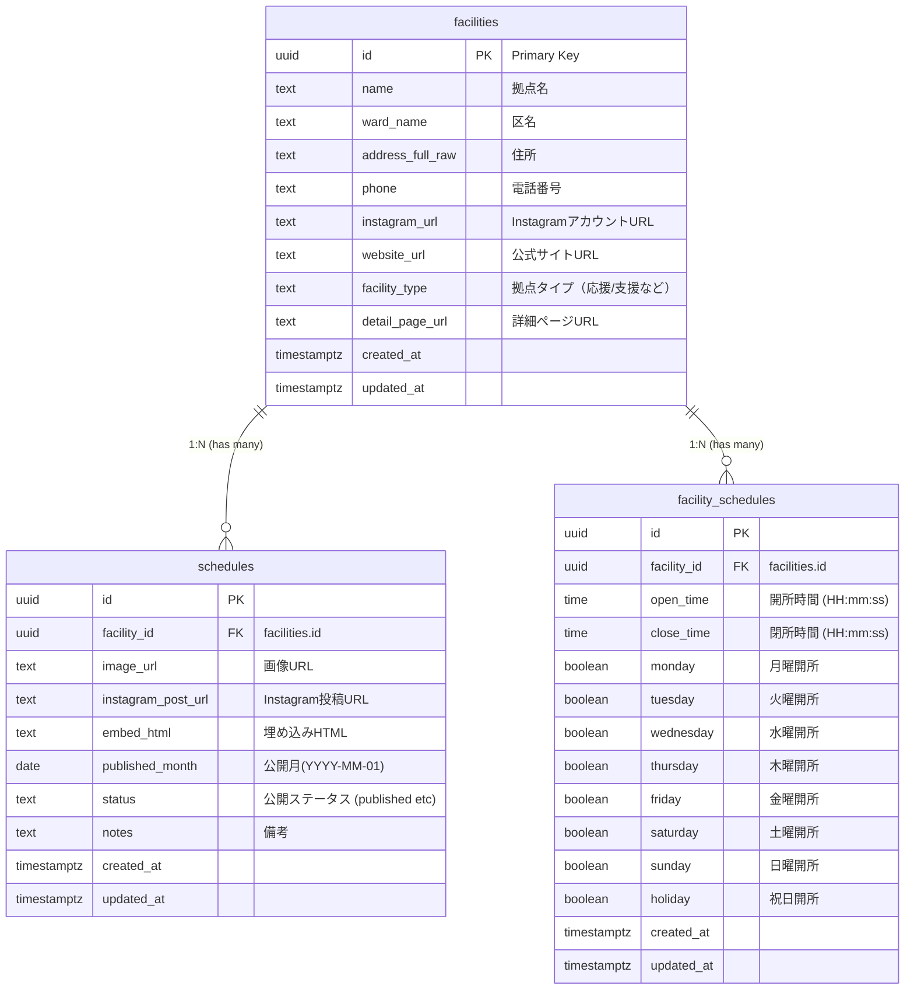

# データベーススキーマ

現在のSupabaseデータベース上の主要なテーブル構造とリレーションです。（最新のTypeScript型定義 `apps/web/lib/types.ts` およびマイグレーションに準拠）

## ER図

## テーブル詳細

### `facilities`
名古屋市内の保育拠点（応援・支援拠点）のマスターデータです。住所やSNSアカウントリンクなどを保持します。

### `facility_schedules`
各拠点の「通常開所スケジュール（曜日×時間帯）」のマスターデータです。1つの拠点が複数の開所パターン（例：平日と土曜で時間が違うなど）を持つため、`1:N` の構成になっています。

### `schedules`
拠点ごとの「月間予定表（画像やInstagram投稿）」データを保持します。`published_month` によって「何月分のスケジュールか」を管理し、月ごとに新しいレコードが作成されます。
